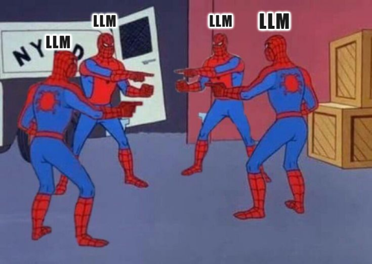

# LLMs-Assemble App


A Gradio-based web interface to compare responses from multiple LLM providers simultaneously.



## Features
- Query multiple LLM providers (OpenAI, Anthropic, Google, Groq, Perplexity) at once
- Chairman Mode: Get AI models to discuss and critique each other's answers
- Real-time updates as responses come in
- In-memory API key storage (no persistent storage)

## Installation
```bash
pip install -r requirements.txt
```

## Usage
```bash
python app.py
```

## Environment Variables
Create a .env file:
```text
OPENAI_API_KEY=sk-...
ANTHROPIC_API_KEY=sk-ant-...
GOOGLE_API_KEY=AIza...
GROQ_API_KEY=gsk_...
PERPLEXITY_API_KEY=pplx-...
```
## Note
API keys entered in the UI are stored in-memory only and will be lost when the app restarts.
For permanent storage, use environment variables.

## PS
This project is inspireb by Andrej karpathy's [llm-council](https://github.com/karpathy/llm-council)
Also this project is far from completion and requires some modifications.

##  License
The code in this repository is licensed under the [MIT License](LICENSE).
